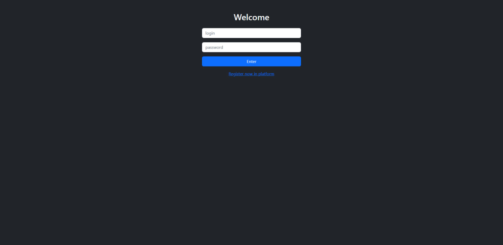
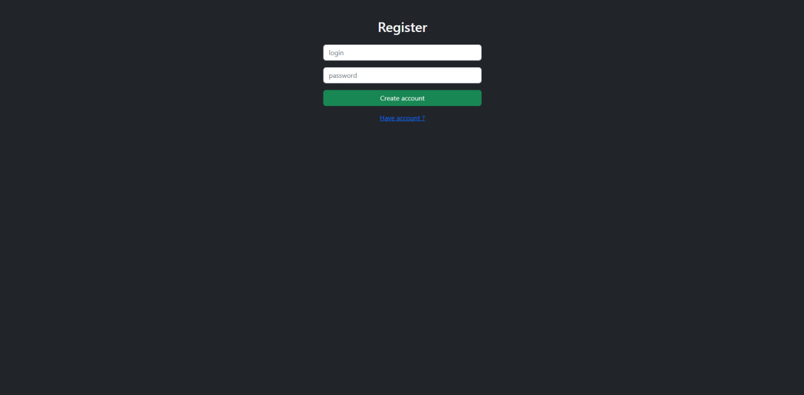
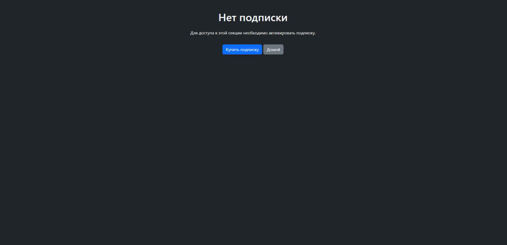
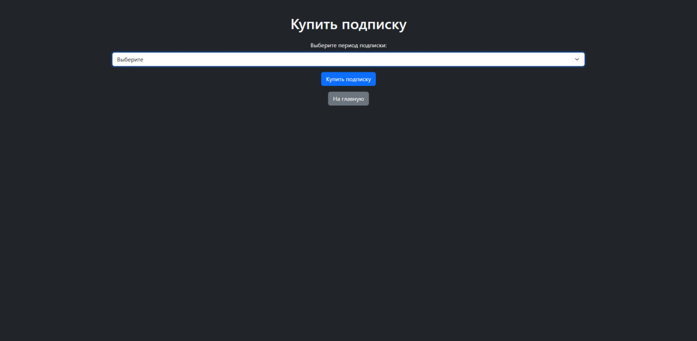
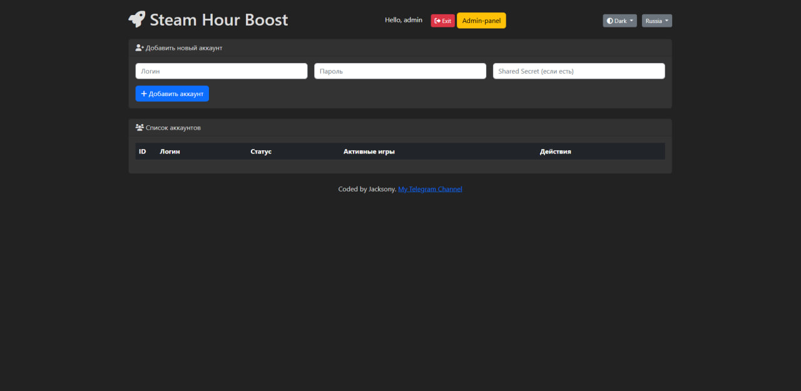
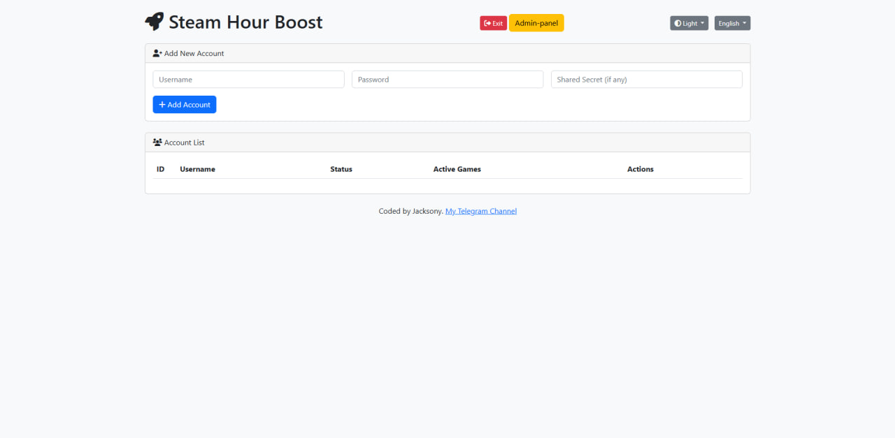
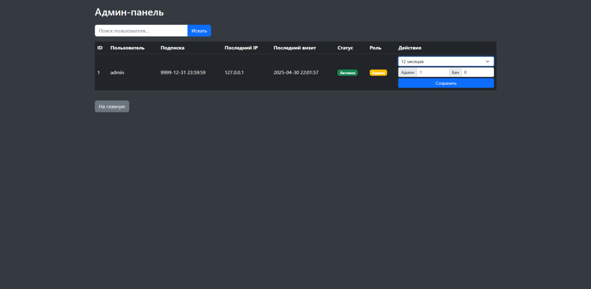

# 🎮 Steam Farming Platform (Flask + Gevent)

This project is a platform for managing multiple Steam accounts with the ability to farm playtime in games, control subscriptions, handle authentication, and provide an admin panel.

## 🚀 Main Features

- 🔐 User registration and login with password encryption (Fernet)
- ⏳ Subscription model with decorator-based checks
- 🎮 Adding Steam accounts (with login and password encryption)
- 🕹️ Game farming (games_played) with start/stop interface
- 📥 Fetching account game list via Steam API
- ⛔ Fetching account ban information
- 👑 Admin panel (grant subscription, ban, manage users)
- 💸 Subscription payment via cryptocurrency (Coinbase Commerce, example)
- 🧠 SQLite + Gevent + Flask + ThreadPoolExecutor

## 📸 Screenshots

| Interface | Description |
|-----------|-------------|
|  | Login form |
|  | Registration form |
|  | No subscription |
|  | Subscription purchase (stub) |
|  | Main page |
|  | Main page (light theme) |
|  | Admin Panel |

## 🛠 Installation

```bash
git clone https://github.com/x1-2023/SteamBoost.git
cd steam-farming-platform
python3 -m venv venv
source venv/bin/activate
pip install -r requirements.txt
